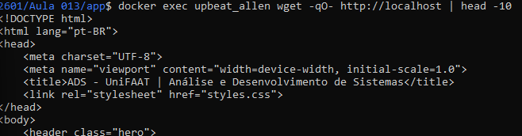

Questão 1
a)

No Amazon EKS, o Control Plane é responsável por controlar o cluster Kubernetes.

Ele executa:

API Server
Scheduler
Controller Manager
etcd

No EKS, o Control Plane é gerenciado pela AWS.

Os Worker Nodes executam os containers da aplicação através dos Pods.

Eles são responsáveis por:

executar workloads;
armazenar imagens;
comunicação de rede.

Os Worker Nodes normalmente são gerenciados pelo cliente.

b)

Self-healing é a capacidade do Kubernetes de restaurar automaticamente aplicações que falharam.

Quando um Pod falha:

Kubernetes detecta a falha;
remove o Pod defeituoso;
cria automaticamente outro Pod.

Isso mantém a quantidade desejada de réplicas.

Questão 2
a)

Deployment:

controla criação e atualização dos Pods.

Service:

expõe os Pods para comunicação interna ou externa.
b)

Labels são pares chave/valor usados para identificar objetos.

Exemplo:

labels:
 app: web

Selectors procuram labels.

Exemplo:

selector:
 app: web

Assim o Service encontra os Pods corretos.

c)

Liveness Probe:
verifica se o container continua saudável.

Exemplo:
reiniciar aplicação travada.

Readiness Probe:
verifica se o container está pronto para receber tráfego.

Exemplo:
esperar banco conectar antes de receber requisições.

Questão 3
a)

A IAM Role do EKS permite que o serviço gerencie recursos AWS.

Exemplos:

criar Load Balancers;
registrar nós;
acessar rede.
b)

A política AmazonEC2ContainerRegistryReadOnly permite baixar imagens do ECR.

Sem ela:

Pods entram em ImagePullBackOff;
containers não iniciam.
Questão 4
a)

ClusterIP:
acesso interno.

NodePort:
abre porta nos Nodes.

LoadBalancer:
cria balanceador externo.

b)

Ao criar Service LoadBalancer, a AWS provisiona automaticamente um Elastic Load Balancer (ELB).

c)

Porque o Load Balancer continua cobrando recursos se não for removido antes do cluster.

Questão 5 — Comandos
a) Criar namespace
kubectl create namespace minha-app
b) Criar deployment
kubectl create deployment web-app \
--image=111222333444.dkr.ecr.us-east-1.amazonaws.com/web-app:v2.0 \
-n minha-app

Escalar:

kubectl scale deployment web-app \
--replicas=3 \
-n minha-app
c) Expor LoadBalancer
kubectl expose deployment web-app \
--type=LoadBalancer \
--port=80 \
--target-port=80 \
-n minha-app
d) Escalar para 5
kubectl scale deployment web-app \
--replicas=5 \
-n minha-app
e) Verificar

Pods:

kubectl get pods -n minha-app

Service:

kubectl get svc -n minha-app 

